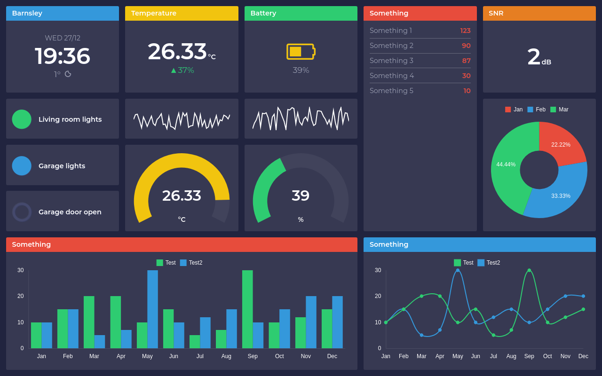

# Vuepoint

A vuejs based dashboard framework



## Build Setup

``` bash
# install dependencies
npm install

# serve with hot reload at localhost:8080
npm run dev

# build for production with minification
npm run build
```

## Supported Tiles

* Value - Simple numeric value with before / after text
* List - List of label and value items
* Battery - A battery level indicator
* Gauage - A gauge display
* Chart - A line, bar or doughnut chart
* Sparkline - A spirkline style chart
* Indicator - An true/false indicator
* Time and Weather - A time and weather display ([From the spatie.be repo](https://github.com/spatie/dashboard.spatie.be/blob/master/resources/assets/js/components/TimeWeather.vue))

## Acknowledgements

This framework uses the [spatie.be](https://github.com/spatie/dashboard.spatie.be) dashboard framework as it's starting point, using the same "spreadsheet" style grid layout system. 

## License

Copyright © 2017 Matt Brialsford. Licensed under the [MIT License](LICENSE)